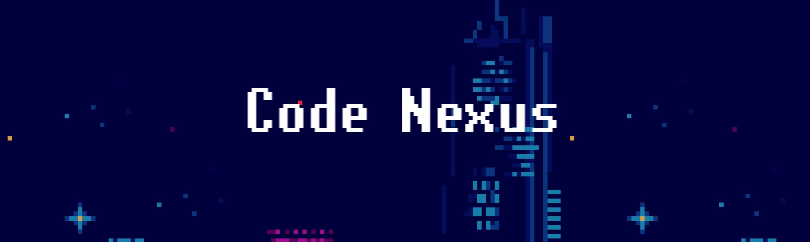

# <p align="center">CODE NEXUS</p>


\
&nbsp;
Live link can be found here - [Code Nexus](https://seanyoung247.github.io/Team2-Hackathon-2023/)

\
&nbsp;

## Table of Content

1. [Goal for hackathon project](#goal-for-hackathon-project)
2. [Features](#features)
    1. [Existing features](#existing-features)
    2. [Future features to implement](#future-features-to-implement)
3. [User Stories](#user-stories)
4. [Strategy](#strategy)
5. [Structure](#structure)
6. [Design choices](#design-choices)

    3. [User Stories](#user-stories)
3. [Design](#design)
    1. [Design Choices](#design-choices)
    2. [Colors](#colors)
    3. [Fonts](#fonts)
    4. [Structure](#structure)
    5. [Wireframes](#wireframes)
4. [Technologies Used](#technologies-used)
    1. [Languages](#languages)
    2. [Frameworks](#frameworks)
    3. [Tools](#tools)
    4. [Pages](#pages)

6. [Validation and Testing](#validation-and-testing)
    1. [HTML Validation](#html-validation)
    2. [CSS Validation](#css-validation)
    3. [JavaScript Validation](#javascript-validation)
    4. [Accessibility](#accessibility)
    5. [Performance](#performance)
    6. [Device testing](#device-testing)
    7. [Browser compatibility](#browser-compatibility)
    8. [Testing user stories](#testing-user-stories)
7. [Bugs](#bugs)
8. [Deployment](#deployment)
9. [Credits](#credits)
    1. [Media](#media)
    2. [Code](#code)
    3. [Acknowledgements](#acknowledgements)
10. [License](#license)

## Goal for hackathon project

The mission for this project was to create a retro game with 80's music and deploy it. In order to particpate one must be a student at Code Institute or an alumni.
**([Promo Banner](/docs/wireframes/hackathon-banner-20231608.jpg))**

The schedule for the Retro Quest hackathon is as follow for August 2023:

- Wednesday, 16th August
    - Register for the Intro Webinar Here, which kicks off the event at 17:00.
    - Teams will be assigned immediately after the Intro Webinar and announced in the Slack channel.
    - Create your team Slack channel and connect with your Team Facilitator.

- Thursday/Friday, 17th & 18th August
    - Set up your team page in the Hackathon app, project board, workspaces, etc.
    - Plan your project, project management, and dividing up of tasks.
    - Recommended first deployment on Friday.

- Saturday/Sunday, 19th & 20th August
    - Each team member dedicates a minimum of 3-5 hours per day to working in sprints on solo tasks, chatting
with, connecting and working together as a team.
    - Continuous deployment.

- Monday, 21st August
    - Final touches to project.
    - Update Hackathon App team page (team name, project name, banner, logo, description, etc.).
    - Final Deployment.
    - Submit project & add details to team page.
    - **3pm sharp - Project Submission Deadline - no further commits or changes to projects.**
    - Register for the Project Presentations Webinar Here @ 17:00: At least one member per team to join and present.

- Tuesday, 22nd August
    - **Winners Announcement** - Winners will be announced at 4pm on Slack.

## Features

### Existing features:

- Gameplay
    - Character movements:
        - WASD inputs: "key presses for using the WASD inputs allows the characer to move on screen (left, right, up, down)"
        - SpaceBar: allows the character to jump
        - In case of invalid character input: "nothing occurs on screen"
    
    - Shooting (projectiles): 
        - Allows the user to defend themselves against enemies
        - Shoot with left click on mouse by aiming where you want to shoot

    - Environment interaction:
        - Climb ladders with W
    - Player Health
        - [Health Bar](docs/wireframes/player-health.jpg "health bar")

- Menu
    - Menu is pressing any key to start game(*kept simplisic due to time constraints*)
    - [Volume Control](docs/wireframes/volume-control.jpg "volume control")

- Game screen
    - [Start Menu](docs/wireframes/start-menu.jpg "start menu")

- Enemy
    - [Alien Enemy](docs/wireframes/enemy.jpg "alien enemy")

- Rules
    - Reach end of map
    - Defeating enemies is up to you but it's harder if you don't 

### Future features to implement

- Scoring system
- shield pick ups  + more weapons
- collectables

## User Stories

- What are the goals for a first-time visitor?
    - Quickly understand that this is a game and how to start it
        - This is indicated by the "Start" option
    - Quickly understand where to look
        - Colorful background image of game with white start button in middle
    - Be able to navigate effortless through the pages
        - No cluster just a simple UI
            - Start button
            - Volume control
     - Easily understand the goal of the game
        - Get from the left side of the screen to the right in order to win while defeating enemies
    - What are the goals for a returning visitor?

## Strategy

The purpose of this site is to create a simple-to-play game that requires an understanding of any platformer shooter. You get health and a weapon and you have to shoot your way through enemies and reach the end screen.

## Structure
The features have been laid out previously. The flow of the website is simple and should be intuitive for mostly anyone.
A start menu that you click and then you're thrown to the action immediately.

## Design choices

- Overview: The aim is to provide easy-controls that most gamers are used to on computers.
    - WASD movement
- The game should be easy for to understand meaning even a child can play it who has an understanding of games.
- It should be clear that the player is done when they reach the end of the map.
- Loss/Win should be clear to understand and should have text that explains what happened.
- Information should not be detailed but fast to read and understand, and straight to the point.

## Technologies used

### Languages

* JavaScript

### Frameworks

* kaboom.js

## Testing

- VS Code workspace was used to test functionality for game
- Before deployment testing with a large number of different inputs. Letters, characters, lengths, reverse, capital, lowercase.

### Browser testing

- Test on Firefox, Edge, Chrome, and Safari
- General testing on the laptop of each team member each using Chrome.
- Testing with different screen sizes

## Bugs 

#### During Testing

- (***Ladder climb***) - when reaching top of ladder player would stutter to reach top
- (***Floor fall***) - For some reason characer would fall through fall in a certain location of map but wouldn't always happen

#### Unfixed Bugs
- (***Jump on crouch***) - while crouched user can still jump in crouch animation
- (***Floor fall***) - For some reason characer would fall through fall in a certain location of map but wouldn't always happen
- Sometimes upon dying or constant refreshes character and enemies will spawn invinsible

## Hosting & Deployment

You can fork the repository by following these steps:

1. Go to the repository on GitHub  
2. Click on the "Fork" button in the upper right hand corner

You can clone the repository by following these steps:

1. Go to the repository on GitHub
2. Locate the "Code" button above the list of files and click it  
3. Select if you prefer to clone using HTTPS, SSH, or Github CLI and click the "copy" button to copy the URL to your clipboard
4. Open Git Bash
5. Change the current working directory to the one where you want the cloned directory
6. Type git clone and paste the URL from the clipboard ($ git clone <https://github.com/YOUR-USERNAME/YOUR-REPOSITORY>)  
7. Press Enter to create your local clone.

### Local deployment

1. Follow the clone steps below and go to step 2
2. Run the following command to install all required packages

```
npm install
```
5. Enter the following command to start up the project locally:
```
npm run dev
```
6. The game can now be accessed locally under [127.0.0.1:8000](https://127.0.0.1:8000)

### Build
1. Follow the clone steps below and go to step 2
2. Run the following command to install all required packages

```
npm install
```
5. Enter the following command to create a build:
```
npm run build
```
6. Your final build is saved into the folder "www"


### Text content

Text content was a collaboration between all team members on our constant ***SLACK***  24/7 calls

### Daily logs

In the ***calls*** folder all daily conversations for the project were logged in.
- [20231608-Call](/docs/calls/20231608.md)
- [20231708-Call](/docs/calls/20231708.md)
- [20231808-Call](/docs/calls/20231808.md)
- [20231908-Call](/docs/calls/20231908.md)
- [20232008-Call](/docs/calls/20232008.md)

### Design

- Map design were mostly assets thanks to:
    - [Warped City](https://ansimuz.itch.io/warped-city "Warped City")

- Main character was also a design from the Warped City assets
- Sprites done by **Abhilash** and **Robin**
- Map design done by **Sean** and **Royer**

### Audio

- Audio files can be found in the audio folder:
    - In game music [here](/www/assets/audio/bg-music-1.mp3)
    - Button click [here](/www/assets/audio/button_click.ogg)
    - Jump sound [here](/www/assets/audio/jump.wav)
    - Enemy damage [here](/www/assets/audio/enemy_damage.wav)
    - Player damage [here](/www/assets/audio/player_damage.wav)
    - Main background music [here](/www/assets/audio/main-bg-music.mp3)


## Credits

- Code Institute for making this event happen
- Everyone in Team 2:
    - **Sean** for being a programming enthusiast and the **veteran** hackathon member
    - **Robin** for also being a enthusiast and the next in line when it comes to hackathon experience
    - **Abhilash** for creating those amazing sprites and always being the lurky in the 24/7 calls

- For those that could not be there until the end:
    - **Dayna** for being super cheerful during all the chaos and creating nice characters.

## License

This project is published under the MIT license.  
[License](/LICENSE.txt)
